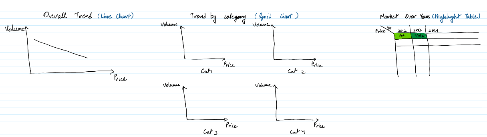

| [home page](https://cmustudent.github.io/tswd-portfolio-templates/) | [visualizing debt](visualizing-government-debt) | [critique by design](critique-by-design) | [final project I](final-project-part-one) | [final project II](final-project-part-two) | [final project III](final-project-part-three) |

# Sweet ~~Treats~~ Trends: A Data-Driven Exploration of the U.S. Confectionery Market
## Outline
This project aims to provide a clear look at the U.S. confectionery market. Using data on revenue, volume, pricing, and consumer demographics, it will show key trends in the industry. The visualization will highlight how changes in product volume and pricing affect sales, as well as which types of confectionery and companies are leading the market. By focusing on these factors, the project will offer insights into what’s driving growth and competition in the U.S. confectionery space.

The project will also compare the U.S. confectionery market with global markets, helping viewers understand how trends and consumer behavior differ across regions. Finally, it will look at future trends, offering predictions on consumption in the coming years. The visualization is designed for business leaders, market researchers, and analysts who want a better understanding of the current state and future outlook of the confectionery industry.

The storyboard will follow the below structure:
1. Introduction to U.S. Confectionery Market
2. Volume and Pricing Trends
3. Revenue Breakdown by Category and Company
4. Consumer Demographics
5. U.S. vs. Global Confectionery Market Comparison
6. Future Outlook and Market Projections

## Initial sketches
- Volume and Pricing Trends

  
- Revenue Breakdown by Category and Company  

  
- Consumer Demographics
  
  
- U.S. vs. Global Confectionery Market Comparison
Will do a graduated color map on Tableau
  
- Future Outlook and Market Projections  
  
  
## The data
The data for this project comes from Statista, a leading provider of market and consumer data, and is being used as part of the Iron Viz competition. Iron Viz is a prestigious data visualization competition that encourages participants to create compelling and insightful visualizations using real-world data. Statista offers extensive datasets on industries, including the U.S. confectionery market, which are key to this project.

The data itself covers various aspects of the confectionery industry, such as revenue, volume, pricing, and consumer demographics. Although the data is aggregated at a high level, it is still broken down into discrete segments like age groups, income levels, and sales categories. To provide actionable insights, I will need to merge these separate datasets, combining factors like revenue and demographics to create my analysis. This process will allow for a deeper understanding of the market and the creation of visualizations that highlight key trends and opportunities.

Data: [Student IronViz Data](Student IronViz Data.xlsx)

## Method and medium
> In a few sentences, you should document how you plan on completing your final project. 
I will be using Shorthand to create my storyboard.

I expect to use Tableau for the below analyses.
- Volume and Pricing Trends
- Revenue Breakdown by Category and Company
- Consumer Demographics
- Future Outlook and Market Projections
- U.S. vs. Global Confectionery Market Comparison

If an opportunity arises, I might tools like Flourish to animate my visualizations.
