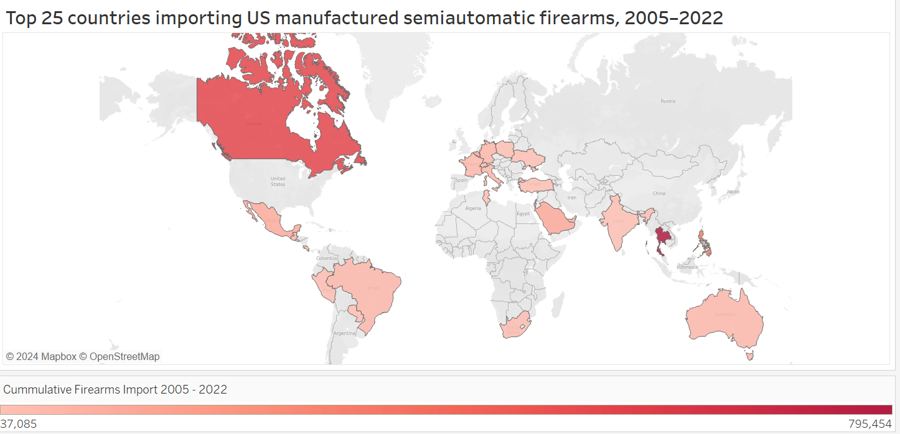
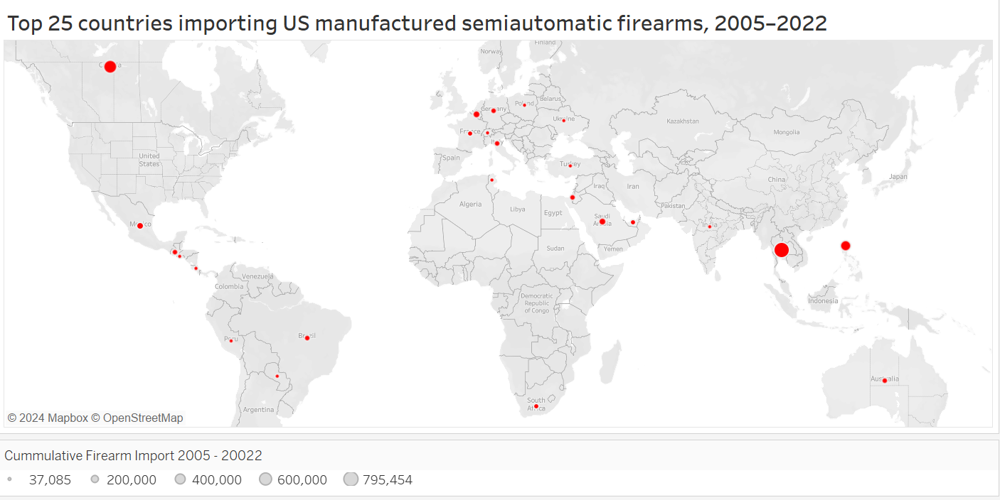
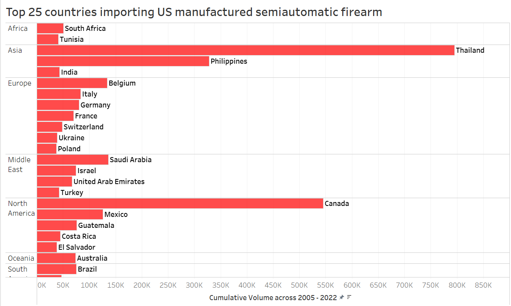

# Makeover Monday
## Visualizing export of firearms from the US, 2005 - 2022

### Introduction

[Makeover Monday](https://makeovermonday.co.uk/) is an online community that improves how we visualize data, one chart at a time. The chart I chose from Makeover Monday's repository is part of a Bloomberg article , ["How the US drives Gun Exports"](https://www.bloomberg.com/graphics/2023-us-made-gun-exports-shootings-violence-sig-sauer/).

Source: https://www.bloomberg.com/graphics/2023-us-made-gun-exports-shootings-violence-sig-sauer/
  
The first thing that stood out to me was that the visualization represented a gunshot, which was an aesthetic choice fitting the topic. It made the audience interested in the story and gets across the point that US is a big exporter of firearms.
  
What didn't work well was the in order to make the visualization appealing, there was no information provided to read the chart. The way that intuitive for me to read the chart was just to read the labels and marks. The visualization and design of depicting the data itself became meaningless. It was only when I spent a good 4 minutes on the visualization that I realised, the visualization had 3 key components:
- thickness of lines to depict the volume of firearm import
- length of line to depict distance from the US
- direction of lines to associate countries with the region they belong to
Another piece of information the chart had was the total number of exported firearms from the US. Looking at the data, I was able to discern that the visualization had top 25 importers. 
  
I started to make my wireframes while trying to retain these key pieces of information.
  
  
### Wireframes  
Since we are talking about firearms, I thought it would be nice to see the geographical reach that the US has while exporting. The original visualization too tried to retain geography by using direction of lines. Hence I tried a chloropeth and graduated symbol map. I was however quick to realise that the chloropeth did injustice to the data due to variations in size of our shaded regions. Thailand was the biggest exporter, but what stood out was Canada. Similarly, when using graduated symbol maps, it was very difficult to compare countries and draw conclusions due to the sparse data points. Hence, I shifted to a bar chart. Below are all my 3 wireframes that I used to conduct user surveys.
  
Chloropeth Wireframe  

  
Graduated symbol Wireframe  

  
Bar chart Wireframe  

  
### Key takeaways of user interviews  
There was confusion created by the title for 2 out of 4 users. The wireframe specific takeaways are as below.
  
**Chloropeth Map**  
- As expected, all 4 of my users were drawn to Canada in the chloropeth map
- One of my user said, for countries with lower import values, he couldn't differentiate between the reds on the map
- Another one of my user said, the legend was not helpful
- None of my users could identify the countries as I had not provided labels
  
**Graduated Symbol Map**  
- As expected, none of my users could pick up on Thailand. They did not like to compare size of bubbles all over the map.
- None of my users could identify the countries as I had not provided labels
  
**Bar Chart**  
- It was immediately easy users to pickout Thailand
- The region was not intuitive to pick from the chart. However when asked, "Do you like having a sense of Geography when talking about the topic of firearm exports", all users said yes.
- One of the users said it was too many data points
  
### Final Solution  
From the user interview experience, it was easy to see that bar charts were more intuitive for readers. The areas to improve would be making region - country association more obvious, providing a better title and possibly reducing the data points. One of the users had suggested using different colours for different regions.  
However, while developing my final solution, I came to the opinion that having just region - country mapping would not be of much value. It would give a sense of geography, but no real inference. Instead if I used a grey-red contrast for each region, the break between regions becomes more obvious, while at the same time we provided the biggest importer within each region. It also becomes easier to compare biggest importer within regions with each other.  
When using this contrast, I believed that though 25 data points requires scrolling down on the chart, the information itself was not a lot to digest, and hence kept all of them in.
  
**Final Solution**  

<noscript></noscript><object class='tableauViz'  style='display:none;'><param name='host_url' value='https%3A%2F%2Fpublic.tableau.com%2F' /> <param name='embed_code_version' value='3' /> <param name='site_root' value='' /><param name='name' value='FirearmExports&#47;barchartColor' /><param name='tabs' value='no' /><param name='toolbar' value='yes' /><param name='static_image' value='https:&#47;&#47;public.tableau.com&#47;static&#47;images&#47;Fi&#47;FirearmExports&#47;barchartColor&#47;1.png' /> <param name='animate_transition' value='yes' /><param name='display_static_image' value='yes' /><param name='display_spinner' value='yes' /><param name='display_overlay' value='yes' /><param name='display_count' value='yes' /><param name='language' value='en-US' /></object>

